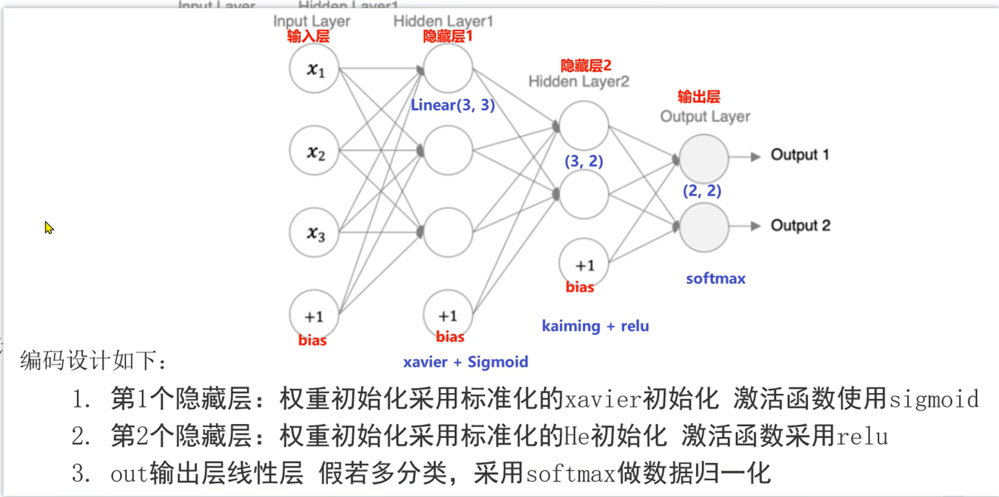

# 搭建神经网络

神经网络 = 层堆叠的过程，继承nn.Module, 实现两个方法
- __init__ 方法定义网络层结构，主要全连接层，并进行初始化
- forward 方法，实例化模型时，底层会自动调用该函数。该函数中为初始化定义的layer传入数据，进行前向传播

加__ __的是魔法方法，底层会**自动调用**，如果需要的时候

搭建流程：
1. 定义一个类，继承nn.Module
2. __init__ 搭建网络
3. forward() 前向传播

DL:
1. 准备数据
2. 搭建神经网络
3. 模型训练 (反向传播)
4. 模型测试

